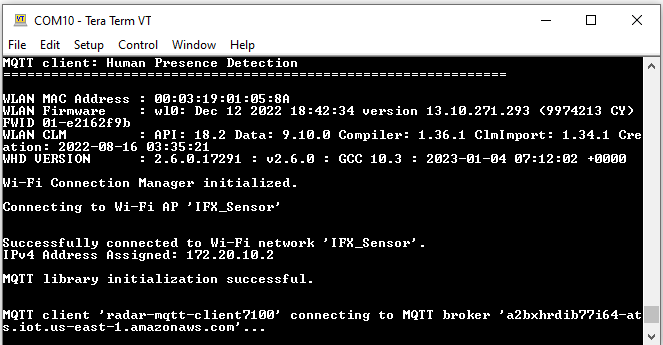

# MQTT client: Human presence detection

## Overview

This code example demonstrates implementing an MQTT client using the [MQTT client library](https://github.com/Infineon/mqtt) together with Infineon's radar presence solution to detect human presence within a configurable distance. Powered by the [XENSIV™ 60-GHz radar](https://www.infineon.com/cms/en/product/sensor/radar-sensors/radar-sensors-for-iot/60ghz-radar/bgt60tr13c/), this solution provides extremely high accuracy in detecting both micro and macro motions. The ability to detect micro motion offers unique benefits over conventional technologies deployed to detect human presence, therefore making it perfect for user interaction with devices.

In this example, the MQTT client RTOS task establishes a connection with the configured MQTT broker, and creates three tasks - publisher, subscriber, and radar. The publisher task publishes messages on the configured topic names i.e., presence or absence status is published on "presence events" topic. The subscriber task subscribes to given topics i.e., "presence configuration", checks for the cloud updates and transmits the received messages to configuration task for further processing. The radar task initializes the radar sensor and presence library with default configurations, creates configuration task, and registers callback functions to handle radar data and presence detection events.
This code example uses the AWS IoT device SDK MQTT client library to implement the MQTT client.
         

[View this README on GitHub.](https://github.com/Infineon/mtb-example-wifi-mqtt-radar-presence)

[Provide feedback on this code example.](https://cypress.co1.qualtrics.com/jfe/form/SV_1NTns53sK2yiljn?Q_EED=eyJVbmlxdWUgRG9jIElkIjoiQ0UyMzY2MzgiLCJTcGVjIE51bWJlciI6IjAwMi0zNjYzOCIsIkRvYyBUaXRsZSI6Ik1RVFQgY2xpZW50OiBIdW1hbiBwcmVzZW5jZSBkZXRlY3Rpb24iLCJyaWQiOiJ1c21hbm11aCIsIkRvYyB2ZXJzaW9uIjoiMS4wLjAiLCJEb2MgTGFuZ3VhZ2UiOiJFbmdsaXNoIiwiRG9jIERpdmlzaW9uIjoiTUNEIiwiRG9jIEJVIjoiU0JTWVMiLCJEb2MgRmFtaWx5IjoiUFNPQyJ9)

## Requirements

- [ModusToolbox&trade; software](https://www.infineon.com/cms/en/design-support/tools/sdk/modustoolbox-software) v3.0 or later (tested with v3.0)
- Board support package (BSP) minimum required version: 4.0.0
- Programming language: C
- Associated parts: All [PSoC&trade; 6 MCU](https://www.infineon.com/cms/en/product/microcontroller/32-bit-psoc-arm-cortex-microcontroller/psoc-6-32-bit-arm-cortex-m4-mcu) parts with SDIO, [AIROC™ CYW43012 Wi-Fi & Bluetooth® combo chip](https://www.infineon.com/dgdl/Infineon-CYW43012_Single-Chip%2CUltra-Low_IEEE_802.11n-compliant_802.11ac-friendly_MAC_Baseband_Radio_with_Bluetooth_5.0_for_IoT-AdditionalTechnicalInformation-v14_00-EN.pdf?fileId=8ac78c8c7d0d8da4017d0ee89f18715f), [AIROC™ CYW4343W Wi-Fi & Bluetooth® combo chip](https://www.infineon.com/dgdl/Infineon-CYW4334WKUBGT-DataSheet-v11_00-EN.pdf?fileId=8ac78c8c7d0d8da4017d0ee1f02f680f)

## Supported toolchains (make variable 'TOOLCHAIN')

- GNU Arm® embedded compiler v10.3.1 (`GCC_ARM`) - Default value of `TOOLCHAIN`
- Arm&reg; compiler v6.16 (`ARM`)
- IAR C/C++ compiler v8.50.6 (`IAR`)

## Supported kits (make variable 'TARGET')

- [Rapid IoT connect developer kit](https://github.com/Infineon/TARGET_CYSBSYSKIT-DEV-01) (`CYSBSYSKIT-DEV-01`) - Default value of `TARGET`

**Note:** This example requires PSoC&trade; 6 MCU devices with at least 2-MB flash and 1-MB SRAM and therefore does not support other PSoC&trade; 6 MCU kits.

## Hardware setup

   This code example requires the XENSIV™ BGT60TR13C radar wing board as part of the connected sensor kit.

   1. Connect the radar wing board to the CYSBSYSKIT-DEV-01 kit through the pin headers.

   2. Connect the CYSBSYSKIT-DEV-01 kit to the PC with the USB cable.

      **Figure 1. Rapid IoT connect developer kit**

      

      **Figure 2. XENSIV&trade; BGT60TR13C wing**

      

   3. Place the CYSBSYSKIT-DEV-01 kit at a fixed location (for example, the corner of a room) to ensure optimal performance of the presence detection application.

## Software setup

Install a terminal emulator if you don't have one. This document uses [Tera Term](https://ttssh2.osdn.jp/index.html.en).

This code example implements a generic MQTT client that can connect to various MQTT brokers. In this document, the instructions to set up and run the MQTT client have been provided for the AWS IoT and Mosquitto MQTT brokers for reference. If you are using this code example with Mosquitto broker running locally on your PC, you need to download and install Mosquitto broker from [mosquitto.org](https://mosquitto.org/download).

This example requires no additional software or tools if you are using the MQTT client with a publicly hosted MQTT broker.

## Using the code example

Create the project and open it using one of the following:

<details><summary><b>In Eclipse IDE for ModusToolbox&trade; software</b></summary>

1. Click the **New Application** link in the **Quick Panel** (or, use **File** > **New** > **ModusToolbox&trade; Application**). This launches the [Project Creator](https://www.infineon.com/ModusToolboxProjectCreator) tool.

2. Select CYSBSYSKIT-DEV-01 kit supported by the code example from the PSoC&trade; 6 BSPs list shown in the **Project Creator - Choose Board Support Package (BSP)** dialog.

   When you select a supported kit, the example is reconfigured automatically to work with the kit. To work with a different supported kit later, use the [Library Manager](https://www.infineon.com/ModusToolboxLibraryManager) to choose the BSP for the supported kit. You can use the Library Manager to select or update the BSP and firmware libraries used in this application. To access the Library Manager, click the link from the **Quick Panel**.

   You can also just start the application creation process again and select a different kit.

   If you want to use the application for a kit not listed here, you may need to update the source files. If the kit does not have the required resources, the application may not work.

3. In the **Project Creator - Select Application** dialog, choose the **MQTT Human Presence** application from Sensing group by enabling the checkbox.

4. (Optional) Change the suggested **New Application Name**.

5. The **Application(s) Root Path** defaults to the Eclipse workspace which is usually the desired location for the application. If you want to store the application in a different location, you can change the *Application(s) Root Path* value. Applications that share libraries should be in the same root path.

6. Click **Create** to complete the application creation process.

For more details, see the [Eclipse IDE for ModusToolbox&trade; software user guide](https://www.infineon.com/MTBEclipseIDEUserGuide) (locally available at *{ModusToolbox&trade; software install directory}/ide_{version}/docs/mt_ide_user_guide.pdf*).

</details>

<details><summary><b>In command-line interface (CLI)</b></summary>

ModusToolbox&trade; software provides the Project Creator as both a GUI tool and a command line tool, "project-creator-cli". The CLI tool can be used to create applications from a CLI terminal or from within batch files or shell scripts. This tool is available in the *{ModusToolbox&trade; software install directory}/tools_{version}/project-creator/* directory.

Use a CLI terminal to invoke the "project-creator-cli" tool. On Windows, use the command line "modus-shell" program provided in the ModusToolbox&trade; software installation instead of a standard Windows command-line application. This shell provides access to all ModusToolbox&trade; software tools. You can access it by typing `modus-shell` in the search box in the Windows menu. In Linux and macOS, you can use any terminal application.

The "project-creator-cli" tool has the following arguments:

Argument | Description | Required/optional
---------|-------------|-----------
`--board-id` | Defined in the `<id>` field of the [BSP](https://github.com/Infineon?q=bsp-manifest&type=&language=&sort=) manifest | Required
`--app-id`   | Defined in the `<id>` field of the [CE](https://github.com/Infineon?q=ce-manifest&type=&language=&sort=) manifest | Required
`--target-dir`| Specify the directory in which the application is to be created if you prefer not to use the default current working directory | Optional
`--user-app-name`| Specify the name of the application if you prefer to have a name other than the example's default name | Optional

<br>

The following example clones the "[MQTT Presence](https://github.com/Infineon/mtb-example-wifi-mqtt-radar-presence)" application with the desired name "MQTTHumanPresence" configured for the *CYSBSYSKIT-DEV-01* BSP into the specified working directory, *C:/mtb_projects*:

   ```
   project-creator-cli --board-id CYSBSYSKIT-DEV-01 --app-id mtb-example-wifi-mqtt-radar-presence --user-app-name MQTTHumanPresence --target-dir "C:/mtb_projects"
   ```

**Note:** The project-creator-cli tool uses the `git clone` and `make getlibs` commands to fetch the repository and import the required libraries. For details, see the "Project creator tools" section of the [ModusToolbox&trade; software user guide](https://www.infineon.com/ModusToolboxUserGuide) (locally available at *{ModusToolbox&trade; software install directory}/docs_{version}/mtb_user_guide.pdf*).

To work with a different supported kit later, use the [Library Manager](https://www.cypress.com/ModusToolboxLibraryManager) to choose the BSP for the supported kit. You can invoke the Library Manager GUI tool from the terminal using `make library-manager` command or use the Library Manager CLI tool "library-manager-cli" to change the BSP.

The "library-manager-cli" tool has the following arguments:

Argument | Description | Required/optional
---------|-------------|-----------
`--add-bsp-name` | Name of the BSP that should be added to the application | Required
`--set-active-bsp` | Name of the BSP that should be as active BSP for the application | Required
`--add-bsp-version`| Specify the version of the BSP that should be added to the application if you do not wish to use the latest from manifest | Optional
`--add-bsp-location`| Specify the location of the BSP (local/shared) if you prefer to add the BSP in a shared path | Optional

<br />

</details>

<details><summary><b>In third-party IDEs</b></summary>

Use one of the following options:

- **Use the standalone [Project Creator](https://www.infineon.com/ModusToolboxProjectCreator) tool:**

   1. Launch Project Creator from the Windows Start menu or from *{ModusToolbox&trade; software install directory}/tools_{version}/project-creator/project-creator.exe*.

   2. In the initial **Choose Board Support Package** screen, select the BSP, and click **Next**.

   3. In the **Select Application** screen, select the appropriate IDE from the **Target IDE** drop-down menu.

   4. Click **Create** and follow the instructions printed in the bottom pane to import or open the exported project in the respective IDE.

<br />

- **Use command-line interface (CLI):**

   1. Follow the instructions from the **In command-line interface (CLI)** section to create the application, and then import the libraries using the `make getlibs` command.

   2. Export the application to a supported IDE using the `make <ide>` command.

   3. Follow the instructions displayed in the terminal to create or import the application as an IDE project.

For a list of supported IDEs and more details, see the "Exporting to IDEs" section of the [ModusToolbox&trade; software user guide](https://www.infineon.com/ModusToolboxUserGuide) (locally available at *{ModusToolbox&trade; software install directory}/docs_{version}/mtb_user_guide.pdf*).

</details>

**Note**: On Windows, the location of the project may cause compilation errors in AWS libraries. The maximum path length can be increased to resolve this issue. Alternatively, moving this project to a shorter path i.e C:\mtb or reducing the length of project name might also work.

**Note:** To use this code example in ModusToolbox v2.4, please refer to [Infineon-XENSIVTM_KIT_CSK_BGT60TR13C-UserGuide](https://www.infineon.com/cms/en/product/evaluation-boards/kit_csk_bgt60tr13c/#!documents) 

## Operation

1. Modify the user configuration files in the *configs* directory as follows:

      1. **Wi-Fi configuration:** Set the Wi-Fi credentials in *configs/wifi_config.h*: Modify the `WIFI_SSID`, `WIFI_PASSWORD`, and `WIFI_SECURITY` macros to match with that of the Wi-Fi network that you want to connect.   

           **For Example**:

           `WIFI_SSID` = **"IFX_Sensor"**

            `WIFI_PASSWORD` = **"XXXXXXXXXXXXXX"**

            `WIFI_SECURITY` = **"WPA2"**


      2. **MQTT configuration:** Set up the MQTT client and configure the credentials in *configs/mqtt_client_config.h*. Some of the important configuration macros are as follows:

         - `MQTT_BROKER_ADDRESS`: Hostname of the MQTT broker

         - `MQTT_PORT`: Port number to be used for the MQTT connection. As specified by Internet Assigned Numbers Authority (IANA), port numbers assigned for MQTT protocol are **1883** for non-secure connections and **8883** for secure connections. However, MQTT brokers may use other ports. Configure this macro as specified by the MQTT broker.

         - `MQTT_SECURE_CONNECTION`: Set this macro to **1** if a secure (TLS) connection to the MQTT broker is required to be established; else **0**.

         - `MQTT_USERNAME` and `MQTT_PASSWORD`: Username and password for client authentication and authorization, if required by the MQTT broker. However, note that this information is generally not encrypted and the password is sent in plain text. Therefore, this is not a recommended method of client authentication.

         - `CLIENT_CERTIFICATE` and `CLIENT_PRIVATE_KEY`: Certificate and private key of the MQTT client used for client authentication. Note that these macros are applicable only when `MQTT_SECURE_CONNECTION` is set to **1**.

         - `ROOT_CA_CERTIFICATE`: Root CA certificate of the MQTT broker

         See [Setting up the MQTT broker](#setting-up-the-mqtt-broker) to learn how to configure these macros for AWS IoT and Mosquitto MQTT brokers.

         For a full list of configuration macros used in this code example, see [Wi-Fi and MQTT configuration macros](#wi-fi-and-mqtt-configuration-macros).

      3. Other configuration files: You can optionally modify the configuration macros in the following files according to your application:

         - *configs/core_mqtt_config.h* used by the [MQTT library](https://github.com/Infineon/mqtt)

         - *configs/FreeRTOSConfig.h* used by the [FreeRTOS library](https://github.com/Infineon/freertos)

2. Open a terminal program and select the [KitProg3](https://www.infineon.com/dgdl/Infineon-KitProg3_User_Guide-UserManual-v01_00-EN.pdf?fileId=8ac78c8c7d0d8da4017d0f01221f1853) COM port. Set the serial port parameters to 8N1 and 115200 baud.

3. Program the board using one of the following:

   <details><summary><b>Using Eclipse IDE for ModusToolbox&trade; software</b></summary>

      1. Select the application project in the Project Explorer.

      2. In the **Quick Panel**, scroll down, and click **\<Application Name> Program (KitProg3_MiniProg4)**.
   </details>

   <details><summary><b>Using CLI</b></summary>

     From the terminal, execute the `make program` command to build and program the application using the default toolchain to the default target. The default toolchain and target are specified in the application's Makefile but you can override those values manually:

      ```
      make program TARGET=<BSP> TOOLCHAIN=<toolchain>
      ```

      Example:

      ```
      make program TARGET=CYSBSYSKIT-DEV-01 TOOLCHAIN=GCC_ARM
      ```

   </details>

   **Note**: While building the project in  some windows machines  it was observed that longer file path is causing "file not found" errors from the dependencies so keep the root path as short as possible  for instance C:\mtb\.
4. After programming, the application starts automatically. Observe the messages on the UART terminal, and wait for the device to make all the required connections.

   **Figure 1. UART terminal showing the application initialization status**

   

5. Once the initialization is complete, confirm that subscription to the topic is successful.
6. If the radar wing board is connected and it detects a sensor event, the following messages are displayed in the terminal:

   **Figure 2. Radar event detected**

   

7. Do the following if a radar event is detected:

   <details><summary><b>For AWS IoT MQTT</b></summary>

   1. Go to AWS IoT-core on the bar on the left.

   2. Open the **MQTT test client** from the **Test** menu to subscribe to the `MQTT_PUB_TOPIC` topic, which is **presence events**. See Figure 3.

      **Figure 3. Radar event detected message on the MQTT broker**

      

      When you configure the device from the MQTT broker (see the first half of Figure 4), the configuration JSON message will be sent to the device within `MQTT_SUB_TOPIC`. The message will be printed out in the terminal. In addition, the device will check and apply the configuration, and give feedback to the MQTT broker (see the second half of Figure 4).

      **Figure 4. Receive configuration message on the MQTT broker**

      

      **Note:** The warning message appears only because the received message is not in JSON format.

      **Figure 5. Receive configuration message**

      

   </details>

   <details><summary><b>For public Mosquitto broker</b></summary>

   1. Run Windows console or Cygwin and go to the directory with mosquitto. Typically it should be in *C:\Program Files\mosquitto*

   2. Subscribe to the topic **presence_status** by running

      ```
      mosquitto_sub -t presence_status -h 192.168.160.122
      ```

   When the radar detects an object, the message will appear on the terminal.

   **Figure 6. Mosquitto broker sending  presence events**

      
      

   3. Next try to configure radar by publishing valid JSON on the **presence config** topic. To do this, run the second console, go to the same directory and run:

      ```
      mosquitto_pub -h 192.168.160.122 -p 1883 -t "presence config" -m "{\"max_range\":1.5}"
      ```

   Then you will see the information that radar successfully changed its parameter.

   **Figure 7. Mosquitto broker sending radar configuration**
   
   

   </details>

   <br>

   **Table 1. Configuration JSON objects**

   (See [XENSIV™ Radar presence API reference guide](https://infineon.github.io/xensiv-radar-presence/html/index.html) library documentation)

   | Key  |  Default value     | Valid values |
   | :------- | :------------    | :--------------------|
   | max_range (m)| 2.0 | 0.66-5.0 |
   | macro_threshold | 1.0 | 0.5-2.0 |
   | micro_threshold | 25.0 | 0.2-50.0 |
   | bandpass_filter | disable | enable/disable|
   | decimation_filter | disable | enable/disable |
   | mode | micro_if_macro | macro_only/micro_only/micro_if_macro/micro_and_macro |

   <br>
   
   **Micro-motions**:
    Detecting small movements like fingure gestures or small headmovements in  a typical smart home environment for instance while working on lapop/keyboard.Micromotion also includes  detection of Stationary humans (normally breathing and blinking eyes) in sitting or standing positions (in line of sight).
   

   **Macro-motions**:
    Detecting major movements into or through the field of view.(Motion Detection).


   **Note**: Macro and Micro threshold parameters can be adjusted to achieve different levels of sensitivity.The  below table summarises three different levels (for instance high means  -solution being more sensitive to stationary peoples).

8. Confirm that the following messages are printed when no wing boards are connected.

   **Figure 8. No wing board connected**

   

This example can be programmed on multiple kits (Only when `GENERATE_UNIQUE_CLIENT_ID` is set to **1**).

Alternatively, the publish and subscribe functionalities of the MQTT client can be individually verified if the MQTT broker supports a Test MQTT client such as the AWS IoT.

Do one of the following:

- **To verify the subscribe functionality**: Using the Test MQTT client, publish messages on the topic specified by the `MQTT_SUB_TOPIC` macro in *mqtt_client_config.h*.

- **To verify the publish functionality**: From the Test MQTT client, subscribe to the MQTT topic specified by the `MQTT_PUB_TOPIC` macro and confirm that the messages published by the kit are displayed on the Test MQTT client's console.

## Debugging

You can debug the example to step through the code. In the IDE, use the **\<Application Name> Debug (KitProg3_MiniProg4)** configuration in the **Quick Panel**. For details, see the "Program and debug" section in the [Eclipse IDE for ModusToolbox&trade; software user guide](https://www.infineon.com/MTBEclipseIDEUserGuide).

**Note:** **(Only while debugging)** On the CM4 CPU, some code in `main()` may execute before the debugger halts at the beginning of `main()`. This means that some code executes twice – once before the debugger stops execution, and again after the debugger resets the program counter to the beginning of `main()`. See [KBA231071](https://community.infineon.com/docs/DOC-21143) to learn about this and for the workaround.

## Design and implementation

This application uses a modular approach to build a remote presence application combining sensor functions including radar driver and presence algorithm library with MQTT client. The components used in this application are shown in **Figure 9**.

**Figure 9. Application overview**


The radar configuration parameters are generated from a PC tool and saved in *radar_settings.h*, for more details please see [XENSIV™ BGT60TRxx Radar API reference guide](https://infineon.github.io/sensor-xensiv-bgt60trxx/html/index.html).

This example implements five RTOS tasks: MQTT client, publisher, subscriber, radar task, and configuration task. The main function initializes the BSP and the retarget-io library, and creates the MQTT client task.

The MQTT client task initializes the Wi-Fi connection manager (WCM) and connects to a Wi-Fi access point (AP) using the Wi-Fi network credentials that are configured in *wifi_config.h*. Upon a successful Wi-Fi connection, the task initializes the MQTT library and establishes a connection with the MQTT broker/server.

The MQTT connection is configured to be secure by default; the secure connection requires a client certificate, a private key, and the root CA certificate of the MQTT broker that are configured in *mqtt_client_config.h*.

After a successful MQTT connection, the subscriber and publisher tasks are created. The MQTT client task then waits for messages from the other two tasks and callbacks, and handles the cleanup operations of various libraries if the messages indicate failure.

The subscriber task subscribes to messages on the topic specified by the `MQTT_SUB_TOPIC` macro that can be configured in *mqtt_client_config.h*. When the subscribe operation fails, a message is sent to the MQTT client task over a message queue. When the subscriber task receives a message from the broker, it prints the information and transmits the configuration parameters to configuration task.

After the initialization the application runs in an event driven way. The radar interrupt is used to notify to radar task which then retrieves the radar data and provides it to the presence library. The events from presence library are sent to publisher task which then transmits them to the server.

When a failure occurs, the MQTT client task handles the cleanup operations of various libraries, thereby terminating any existing MQTT and Wi-Fi connections and deleting the MQTT, publisher, and subscriber tasks.

### Sensor information and LEDs

1. For CYSBSYSKIT-DEV-01, the radar task is suspended if the radar wing board is not connected to the feather kit.

2. The LED on Radar board indicates different events with different colors as follows:

    **Table 2. Events and LED indication**

   | LED color  |  Event type  |  Description  |
   | ----------- | ----------- | -----    |
   | Red  | `XENSIV_RADAR_PRESENCE_STATE_MACRO_PRESENCE` | Presence event detected.
   | Red  | `XENSIV_RADAR_PRESENCE_STATE_MICRO_PRESENCE` | Presence event detected.
   | Green  | `XENSIV_RADAR_PRESENCE_STATE_ABSENCE ` | Absence event detected.

### Configuring the MQTT client

#### Wi-Fi and MQTT configuration macros

 Macro                               |  Description
 :---------------------------------- | :------------------------
 **Wi-Fi Connection Configurations**  |  In *configs/wifi_config.h*
 `WIFI_SSID`       | SSID of the Wi-Fi AP to which the MQTT client connects
 `WIFI_PASSWORD`   | Passkey/password for the Wi-Fi SSID specified above
 `WIFI_SECURITY`   | Security type of the Wi-Fi AP. See `cy_wcm_security_t` structure in *cy_wcm.h* for details.
 `MAX_WIFI_CONN_RETRIES`   | Maximum number of retries for Wi-Fi connection
 `WIFI_CONN_RETRY_INTERVAL_MS`   | Time interval in milliseconds in between successive Wi-Fi connection retries
 **MQTT Connection Configurations**  |  In *configs/mqtt_client_config.h*
 `MQTT_BROKER_ADDRESS`      | Hostname of the MQTT broker
 `MQTT_PORT`                | Port number to be used for the MQTT connection. As specified by IANA, port numbers assigned for MQTT protocol are **1883** for non-secure connections and **8883** for secure connections. However, MQTT brokers may use other ports. Configure this macro as specified by the MQTT broker.
 `MQTT_SECURE_CONNECTION`   | Set this macro to **1** if a secure (TLS) connection to the MQTT broker is required to be established; else **0**.
 `MQTT_USERNAME` <br> `MQTT_PASSWORD`   | Username and password for client authentication and authorization, if required by the MQTT broker. However, note that this information is generally not encrypted and the password is sent in plain text. Therefore, this is not a recommended method of client authentication.
 **MQTT Client Certificate Configurations**  |  In *configs/mqtt_client_config.h*
 `CLIENT_CERTIFICATE` <br> `CLIENT_PRIVATE_KEY`  | Certificate and private key of the MQTT client used for client authentication. Note that these macros are applicable only when `MQTT_SECURE_CONNECTION` is set to **1**.
 `ROOT_CA_CERTIFICATE`      |  Root CA certificate of the MQTT broker
 **MQTT Message Configurations**    |  In *configs/mqtt_client_config.h*
 `MQTT_PUB_TOPIC`           | MQTT topic to which the messages are published by the publisher task to the MQTT broker
 `MQTT_SUB_TOPIC`           | MQTT topic to which the subscriber task subscribes to. The MQTT broker sends the messages to the subscriber that are published in this topic (or equivalent topic).
 `MQTT_MESSAGES_QOS`        | The Quality of Service (QoS) level to be used by the publisher and subscriber. Valid choices are **0**, **1**, and **2**.
 `ENABLE_LWT_MESSAGE`       | Set this macro to **1** if you want to use the 'Last Will and Testament (LWT)' option; else **0**. LWT is an MQTT message that will be published by the MQTT broker on the specified topic if the MQTT connection is unexpectedly closed. This configuration is sent to the MQTT broker during MQTT connect operation; the MQTT broker will publish the Will message on the Will topic when it recognizes an unexpected disconnection from the client.
 `MQTT_WILL_TOPIC_NAME` <br> `MQTT_WILL_MESSAGE`   | The MQTT topic and message for the LWT option described above. These configurations are applicable only when `ENABLE_LWT_MESSAGE` is set to **1**.
 `MQTT_DEVICE_ON_MESSAGE` <br> `MQTT_DEVICE_OFF_MESSAGE`  | The MQTT messages that control the device (LED) state in this code example.
 **Other MQTT Client Configurations**    |  In *configs/mqtt_client_config.h*
 `GENERATE_UNIQUE_CLIENT_ID`   | Every active MQTT connection must have a unique client identifier. If this macro is set to **1**, the device will generate a unique client identifier by appending a timestamp to the string specified by the `MQTT_CLIENT_IDENTIFIER` macro. This feature is useful if you are using the same code on multiple kits simultaneously.
 `MQTT_CLIENT_IDENTIFIER`     | The client identifier (client ID) string to be used during MQTT connection. If `GENERATE_UNIQUE_CLIENT_ID` is set to **1**, a timestamp is appended to this macro value and used as the client ID; else, the value specified for this macro is directly used as the client ID.
 `MQTT_CLIENT_IDENTIFIER_MAX_LEN`   | The longest client identifier that an MQTT server must accept (as defined by the MQTT 3.1.1 spec) is 23 characters. However, some MQTT brokers support longer client IDs. Configure this macro as per the MQTT broker specification.
 `MQTT_TIMEOUT_MS`            | Timeout in milliseconds for MQTT operations in this example
 `MQTT_KEEP_ALIVE_SECONDS`    | The keepalive interval in seconds used for MQTT ping request
 `MQTT_ALPN_PROTOCOL_NAME`   | The application layer protocol negotiation (ALPN) protocol name to be used that is supported by the MQTT broker in use. Note that this is an optional macro for most of the use cases. <br>Per IANA, the port numbers assigned for MQTT protocol are 1883 for non-secure connections and 8883 for secure connections. In some cases, there is a need to use other ports for MQTT such as port 443 (which is reserved for HTTPS). ALPN is an extension to TLS that allows many protocols to be used over a secure connection.
 `MQTT_SNI_HOSTNAME`   | The server name indication (SNI) host name to be used during the transport layer security (TLS) connection as specified by the MQTT broker. <br>SNI is extension to the TLS protocol. As required by some MQTT brokers, SNI typically includes the hostname in the "Client Hello" message sent during TLS handshake.
 `MQTT_NETWORK_BUFFER_SIZE`   | A network buffer is allocated for sending and receiving MQTT packets over the network. Specify the size of this buffer using this macro. Note that the minimum buffer size is defined by the `CY_MQTT_MIN_NETWORK_BUFFER_SIZE` macro in the MQTT library.
 `MAX_MQTT_CONN_RETRIES`   | Maximum number of retries for MQTT connection
 `MQTT_CONN_RETRY_INTERVAL_MS`   | Time interval in milliseconds in between successive MQTT connection retries

<br>

#### Setting up the MQTT broker

<details><summary><b>AWS IoT MQTT</b></summary>

 1. Set up the MQTT device (also known as a *Thing*) in the AWS IoT core as described in the [Getting started with AWS IoT tutorial](https://docs.aws.amazon.com/iot/latest/developerguide/iot-gs.html).

    **Note:** While setting up your device, ensure that the policy associated with this device permits all MQTT operations (*iot:Connect*, *iot:Publish*, *iot:Receive*, and *iot:Subscribe*) for the resource used by this device. For testing purposes, use the following policy document which allows all *MQTT Policy Actions* on all *Amazon Resource Names (ARNs)*.

    ```
    {
        "Version": "2012-10-17",
        "Statement": [
            {
                "Effect": "Allow",
                "Action": "iot:*",
                "Resource": "*"
            }
        ]
    }
    ```

 2. In the *configs/mqtt_client_config.h* file, set `MQTT_BROKER_ADDRESS` to your custom endpoint on the **Settings** page of the AWS IoT console. This has the format `ABCDEFG1234567.iot.<region>.amazonaws.com`.

 3. Set the macros `MQTT_PORT` to **8883** and `MQTT_SECURE_CONNECTION` to **1** in the *configs/mqtt_client_config.h* file.

 4. Download the following certificates and keys that are created and activated in the previous step:

       - A certificate for the AWS IoT Thing - *xxxxxxxxxx.cert.pem*
       - A public key - *xxxxxxxxxx.public.key*
       - A private key - *xxxxxxxxxx.private.key*
       - Root CA "RSA 2048 bit key: Amazon Root CA 1" for AWS IoT from [CA certificates for server authentication](https://docs.aws.amazon.com/iot/latest/developerguide/server-authentication.html#server-authentication-certs).

 5. Using these certificates and keys, enter the following parameters in *mqtt_client_config.h* in Privacy-Enhanced Mail (PEM) format:
       - `CLIENT_CERTIFICATE` - *xxxxxxxxxx.cert.pem*
       - `CLIENT_PRIVATE_KEY` - *xxxxxxxxxx.private.key*
       - `ROOT_CA_CERTIFICATE` - Root CA certificate

    You can either convert the values to strings manually following the format shown in *mqtt_client_config.h* or you can use the HTML utility available [here](https://github.com/Infineon/amazon-freertos/blob/master/tools/certificate_configuration/PEMfileToCString.html) to convert the certificates and keys from PEM format to C string format. You need to clone the repository from GitHub to use the utility.

</details>

<details><summary><b>Local Mosquitto broker</b></summary>

Download and install the Mosquitto broker for your PC from <https://mosquitto.org/download>. The following instructions help in setting up the Mosquitto broker for a secure connection with the client using self-signed SSL certificates. This requires **OpenSSL** which is already preloaded in the ModusToolbox&trade; software installation. Run the following commands with a CLI (on Windows, use the command line "modus-shell" program provided in the ModusToolbox&trade; software installation instead of the standard Windows command-line application).

**Note:** Please note the use network security system may block the ports used by local Mosquitto broker. In this case contact you network administrator to resolve the issue. 

1. Generate the CA certificate for the Mosquitto broker / server using the following commands. Follow the instructions in the command window to provide the details required.

   ```
   openssl genrsa -out ca.key 2048
   openssl req -new -x509 -sha256 -nodes -days 365 -key ca.key -out ca.crt
   ```

2. Generate the server key pair and server certificate (signed using the CA certificate from Step 1) for the Mosquitto broker using the following commands. Follow the instructions in the command window to provide the details required.

   ```
   openssl genrsa -out server.key 2048
   openssl req -new -nodes -sha256 -key server.key -out server.csr
   openssl x509 -req -sha256 -in server.csr -CA ca.crt -CAkey ca.key -CAcreateserial -out server.crt -days 365
   ```

   At this stage, the certificates and keys required by the Mosquitto broker are ready. The files used from these steps are *ca.crt*, *server.crt*, and *server.key*.

3. Create a configuration file for the Mosquitto broker - *mosquitto.conf* with the following contents and provide the path to the generated credentials (*ca.crt*, *server.crt*, and *server.key*) under the **SSL settings** section.

    ```
   # Config file for mosquitto
   connection_messages true
   per_listener_settings true
   listener 1883
   require_certificate true
   use_identity_as_username true
   allow_anonymous false
   cafile <path-to-ca.crt>
   keyfile <path-to-server.key>
   certfile <path-to-server.crt>
   ```

4. Start the Mosquitto broker with the configurations from the above *mosquitto.conf* file using the following command. If the *mosquitto.conf* file is present in a different location from where the command is run, provide the path to the config file after the `-c` argument.

   ```
   mosquitto -v -c mosquitto.conf
   ```

5. Generate the client certificates using the following commands. Follow the instructions in the command window to provide the details required. Note that the last command requires *ca.crt* and *ca.key* files generated in Step 2.

   ```
   openssl genrsa -out client.key 2048
   openssl req -new -out client.csr -key client.key
   openssl x509 -req -in client.csr -CA ca.crt -CAkey ca.key -CAcreateserial -out client.crt -days 365
   ```

6. Configure the MQTT client configurations in *configs/mqtt_client_config.h* as follows:

     - `MQTT_BROKER_ADDRESS` as the IP address of the PC running the Mosquitto broker (the PC on which Step 4 is performed).

     - `MQTT_PORT` as **1883**.

     - `MQTT_SECURE_CONNECTION` as **1**.

     - Using the client certificate (*client.crt*), private key (*client.key*), and root CA certificate (*ca.crt*) from the above steps, configure the `CLIENT_CERTIFICATE`, `CLIENT_PRIVATE_KEY`, and `ROOT_CA_CERTIFICATE` macros respectively.

       You can either convert the PEM format values to strings manually following the format shown in *mqtt_client_config.h* or you can use the HTML utility available [here](https://github.com/Infineon/amazon-freertos/blob/master/tools/certificate_configuration/PEMfileToCString.html) to convert the certificates and keys from PEM format to C string format. You need to clone the repository from GitHub to use the utility.

</details>

Although this section provides instructions only for AWS IoT and the local Mosquitto broker, the MQTT client implemented in this example is generic. It is expected to work with other MQTT brokers with appropriate configurations. See the [list of publicly-accessible MQTT brokers](https://github.com/mqtt/mqtt.github.io/wiki/public_brokers) that can be used for testing and prototyping purposes.

### Resources and settings

**Table 3. Application source files**

|**File name**            |**Comments**         |
| ------------------------|-------------------- |
| *main.c* | Contains the application entry point. It initializes the UART for debugging and then initializes the controller tasks|
| *mqtt_client_config.c* | Global variables for MQTT connection|
| *mqtt_task.c* | Contains the task function to do the following: <br> 1. Establish an MQTT connection <br> 2. Start the publisher and subscriber tasks <br> 3. Start the radar task|
| *publisher_task.c* | Contains the task function to publish message to the MQTT broker|
| *subscriber_task.c* | Contains the task function to subscribe message from the MQTT broker|
| *radar_task.c* | Contains the task function for the presence and entrance counter application (select at compile time), as well as the callback function|
| *radar_config_task.c* | Contains the task function to configure the xensiv-radar-sensing library |

<br>

## Related resources

Resources  | Links
-----------|----------------------------------
Application notes  | [AN228571](https://www.infineon.com/AN228571) – Getting started with PSoC&trade; 6 MCU on ModusToolbox&trade; software <br />  [AN215656](https://www.infineon.com/AN215656) – PSoC&trade; 6 MCU: Dual-CPU system design <br />
Code examples  | [Using ModusToolbox&trade; software](https://github.com/Infineon/Code-Examples-for-ModusToolbox-Software) on GitHub <br />
Device documentation | [PSoC&trade; 6 MCU datasheets](https://www.infineon.com/cms/en/product/microcontroller/32-bit-psoc-arm-cortex-microcontroller/psoc-6-32-bit-arm-cortex-m4-mcu/#!documents) <br /> [PSoC&trade; 6 technical reference manuals](https://www.infineon.com/cms/en/product/microcontroller/32-bit-psoc-arm-cortex-microcontroller/psoc-6-32-bit-arm-cortex-m4-mcu/#!documents)<br />
Development kits | [Rapid IoT connect developer kit](https://www.infineon.com/cms/en/product/evaluation-boards/kit_csk_bgt60tr13c/) <br>
Libraries on GitHub  | [sensor-xensiv-bgt60trxx](https://github.com/Infineon/sensor-xensiv-bgt60trxx) –  Driver library to interface with the XENSIV&trade; BGT60TRxx 60 GHz FMCW Radar Sensors <br /> [xensiv-radar-presence](https://github.com/Infineon/xensiv-radar-presence) – Presence library to detect human presence using XENSIV&trade; BGT60TR13C <br /> [sensor-dsp](https://github.com/Infineon/sensor-dsp) – Sensor-DSP library to provide signal processing functions for sensor applications <br /> [mtb-pdl-cat1](https://github.com/Infineon/mtb-pdl-cat1) – PSoC&trade; 6 peripheral driver library (PDL)  <br /> [mtb-hal-cat1](https://github.com/Infineon/mtb-hal-cat1) – Hardware abstraction layer (HAL) library <br /> [retarget-io](https://github.com/Infineon/retarget-io) – Utility library to retarget STDIO messages to a UART port <br />
Middleware on GitHub  | [mqtt](https://github.com/Infineon/mqtt) – MQTT client library and docs <br>  [wifi-core-freertos-lwip-mbedtls](https://github.com/Infineon/wifi-core-freertos-lwip-mbedtls) – Wi-Fi connectivity libraries and docs <br> [psoc6-middleware](https://github.com/Infineon/modustoolbox-software#psoc-6-middleware-libraries) – Links to all PSoC&trade; 6 MCU middleware
Tools  | [Eclipse IDE for ModusToolbox&trade; software](https://www.infineon.com/modustoolbox) – ModusToolbox&trade; software is a collection of easy-to-use software and tools enabling rapid development with Infineon MCUs, covering applications from embedded sense and control to wireless and cloud-connected systems using AIROC&trade; Wi-Fi and Bluetooth® connectivity devices. <br />

<br />

## Other resources

Infineon provides a wealth of data at www.infineon.com to help you select the right device, and quickly and effectively integrate it into your design.

For PSoC&trade; 6 MCU devices, see [How to design with PSoC&trade; 6 MCU - KBA223067](https://community.infineon.com/docs/DOC-14644) in the Infineon community.

For more information about connected-sensor-kit, see [IoT sensors platform](https://www.infineon.com/connectedsensorkit) and [Infineon’s XENSIV&trade; connected sensor kit (CSK)](https://livestream.com/infineontechnologies/connected-sensor-kit)

## Document history

Document title: *CE236638* – *MQTT client: Human presence detection*

 Version | Description of change
 ------- | ---------------------
 0.5.1   | New code example
 1.0.0   | Major update to support ModusToolbox&trade; software v3.0 <br /> CE will not be backward compatible with previous versions of ModusToolbox&trade; software 
<br />

---------------------------------------------------------

© Cypress Semiconductor Corporation, 2020-2022. This document is the property of Cypress Semiconductor Corporation, an Infineon Technologies company, and its affiliates ("Cypress").  This document, including any software or firmware included or referenced in this document ("Software"), is owned by Cypress under the intellectual property laws and treaties of the United States and other countries worldwide.  Cypress reserves all rights under such laws and treaties and does not, except as specifically stated in this paragraph, grant any license under its patents, copyrights, trademarks, or other intellectual property rights.  If the Software is not accompanied by a license agreement and you do not otherwise have a written agreement with Cypress governing the use of the Software, then Cypress hereby grants you a personal, non-exclusive, nontransferable license (without the right to sublicense) (1) under its copyright rights in the Software (a) for Software provided in source code form, to modify and reproduce the Software solely for use with Cypress hardware products, only internally within your organization, and (b) to distribute the Software in binary code form externally to end users (either directly or indirectly through resellers and distributors), solely for use on Cypress hardware product units, and (2) under those claims of Cypress’s patents that are infringed by the Software (as provided by Cypress, unmodified) to make, use, distribute, and import the Software solely for use with Cypress hardware products.  Any other use, reproduction, modification, translation, or compilation of the Software is prohibited.
<br />
TO THE EXTENT PERMITTED BY APPLICABLE LAW, CYPRESS MAKES NO WARRANTY OF ANY KIND, EXPRESS OR IMPLIED, WITH REGARD TO THIS DOCUMENT OR ANY SOFTWARE OR ACCOMPANYING HARDWARE, INCLUDING, BUT NOT LIMITED TO, THE IMPLIED WARRANTIES OF MERCHANTABILITY AND FITNESS FOR A PARTICULAR PURPOSE.  No computing device can be absolutely secure.  Therefore, despite security measures implemented in Cypress hardware or software products, Cypress shall have no liability arising out of any security breach, such as unauthorized access to or use of a Cypress product. CYPRESS DOES NOT REPRESENT, WARRANT, OR GUARANTEE THAT CYPRESS PRODUCTS, OR SYSTEMS CREATED USING CYPRESS PRODUCTS, WILL BE FREE FROM CORRUPTION, ATTACK, VIRUSES, INTERFERENCE, HACKING, DATA LOSS OR THEFT, OR OTHER SECURITY INTRUSION (collectively, "Security Breach").  Cypress disclaims any liability relating to any Security Breach, and you shall and hereby do release Cypress from any claim, damage, or other liability arising from any Security Breach.  In addition, the products described in these materials may contain design defects or errors known as errata which may cause the product to deviate from published specifications. To the extent permitted by applicable law, Cypress reserves the right to make changes to this document without further notice. Cypress does not assume any liability arising out of the application or use of any product or circuit described in this document. Any information provided in this document, including any sample design information or programming code, is provided only for reference purposes.  It is the responsibility of the user of this document to properly design, program, and test the functionality and safety of any application made of this information and any resulting product.  "High-Risk Device" means any device or system whose failure could cause personal injury, death, or property damage.  Examples of High-Risk Devices are weapons, nuclear installations, surgical implants, and other medical devices.  "Critical Component" means any component of a High-Risk Device whose failure to perform can be reasonably expected to cause, directly or indirectly, the failure of the High-Risk Device, or to affect its safety or effectiveness.  Cypress is not liable, in whole or in part, and you shall and hereby do release Cypress from any claim, damage, or other liability arising from any use of a Cypress product as a Critical Component in a High-Risk Device. You shall indemnify and hold Cypress, including its affiliates, and its directors, officers, employees, agents, distributors, and assigns harmless from and against all claims, costs, damages, and expenses, arising out of any claim, including claims for product liability, personal injury or death, or property damage arising from any use of a Cypress product as a Critical Component in a High-Risk Device. Cypress products are not intended or authorized for use as a Critical Component in any High-Risk Device except to the limited extent that (i) Cypress’s published data sheet for the product explicitly states Cypress has qualified the product for use in a specific High-Risk Device, or (ii) Cypress has given you advance written authorization to use the product as a Critical Component in the specific High-Risk Device and you have signed a separate indemnification agreement.
<br />
Cypress, the Cypress logo, and combinations thereof, WICED, ModusToolbox, PSoC, CapSense, EZ-USB, F-RAM, and Traveo are trademarks or registered trademarks of Cypress or a subsidiary of Cypress in the United States or in other countries. For a more complete list of Cypress trademarks, visit www.infineon.com. Other names and brands may be claimed as property of their respective owners.
